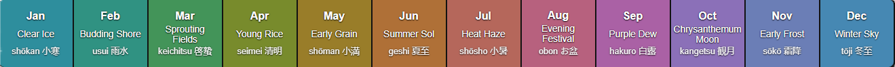

# jūniro 🍂
> from _"jūni no iro"_ — _"the twelve colors"_

A 12-color palette inspired by the **Japanese sekki** (microseasons), mapped to each month of the year. Each color reflects seasonal changes in nature, festivals, and traditional imagery.




## 📅 The Twelve Colors

| Month | Name               | Hex       | Sekki            | Meaning                       |
| ----- | ------------------ | --------- | ---------------- | ----------------------------- |
| Jan   | Clear Ice          | `#3dbed2` | 小寒 (Shōkan)    | Deep winter, frozen rivers    |
| Feb   | Budding Shore      | `#40c3ae` | 雨水 (Usui)      | Snow melts, water flows       |
| Mar   | Sprouting Fields   | `#5ac577` | 啓蟄 (Keichitsu) | First shoots emerge           |
| Apr   | Young Rice         | `#a0b93b` | 清明 (Seimei)    | Fields turn fresh green       |
| May   | Early Grain        | `#cca737` | 小満 (Shōman)    | Barley ripens                 |
| Jun   | Summer Sol         | `#ea9549` | 夏至 (Geshi)     | Sun at its zenith             |
| Jul   | Heat Haze          | `#f28a7a` | 小暑 (Shōsho)    | Warm winds, cicadas sing      |
| Aug   | Evening Festival   | `#f481a8` | お盆 (Obon)      | Lanterns and blossoms         |
| Sep   | Purple Dew         | `#e382dc` | 白露 (Hakuro)    | Cool mornings, autumn flowers |
| Oct   | Chrysanthemum Moon | `#b996f5` | 観月 (Kangetsu)  | Harvest moon nights           |
| Nov   | Early Frost        | `#8fa8f3` | 霜降 (Sōkō)      | Frost on the fields           |
| Dec   | Winter Sky         | `#5db5ef` | 冬至 (Tōji)      | Clear, cold solstice days     |


## 📦 Usage

### CSS
```css
@import url('juniro.css');

body {
  background-color: var(--jan-clear-ice);
}
```

### JSON
```json
{
  "jan-clear-ice":          "#3dbed2",
  "feb-budding-shore":      "#40c3ae",
  "mar-sprouting-fields":   "#5ac577",
  "apr-young-rice":         "#a0b93b",
  "may-early-grain":        "#cca737",
  "jun-summer-sol":         "#ea9549",
  "jul-heat-haze":          "#f28a7a",
  "aug-evening-festival":   "#f481a8",
  "sep-purple-dew":         "#e382dc",
  "oct-chrysanthemum-moon": "#b996f5",
  "nov-early-frost":        "#8fa8f3",
  "dec-winter-sky":         "#5db5ef"
}
```


## 🌐 Demo
[Live Preview](https://gurki.github.io/juniro/)


## 📜 License

[](https://opensource.org/licenses/MIT)
[](https://creativecommons.org/publicdomain/zero/1.0/)

- **Code** (CSS, JSON, SCSS) is licensed under the [MIT License](LICENSE.md#mit-license-for-code).
- **Text and images** are released under [CC0 1.0 Universal](LICENSE.md#cc0-10-universal-for-text--images) — public domain, no restrictions.